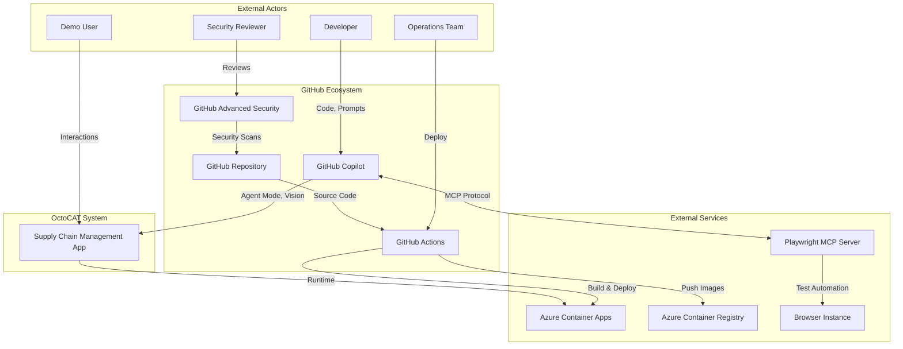
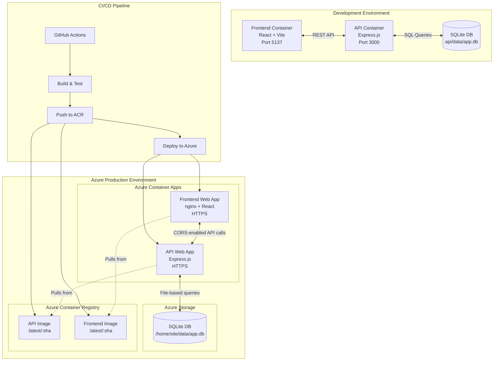
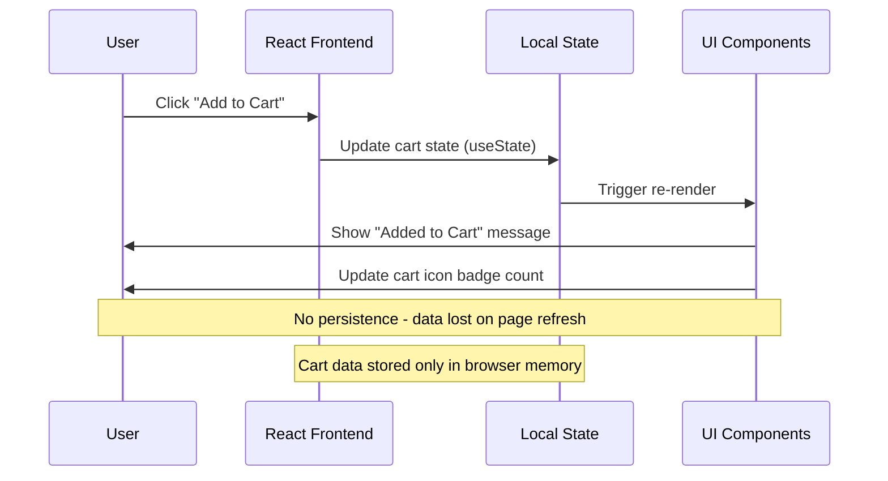
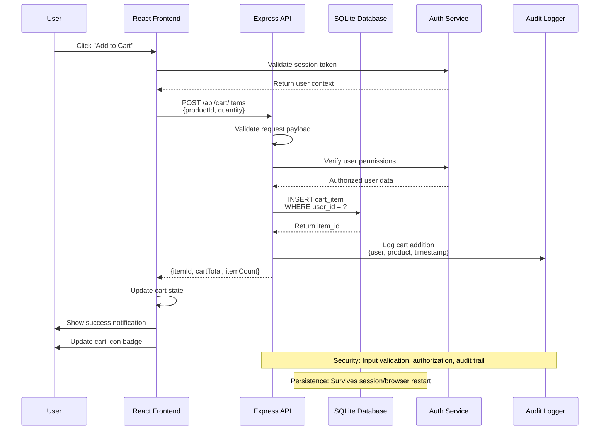
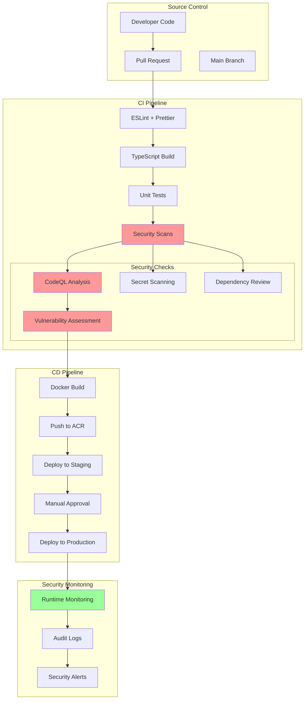
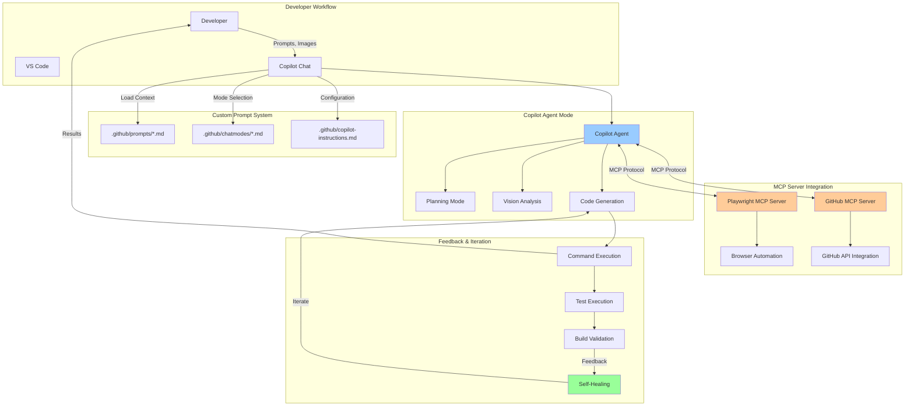
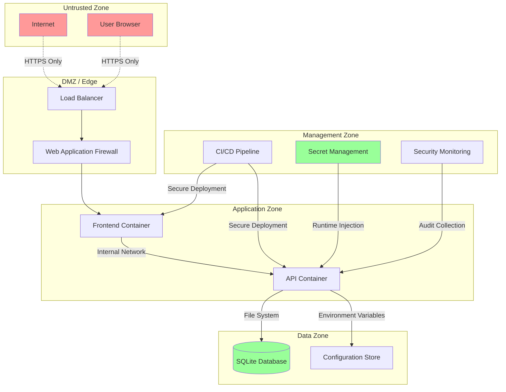

# OctoCAT Supply Chain Management: Architecture & Dataflow Documentation

## Purpose

This document provides comprehensive architectural views and dataflow analysis for the OctoCAT Supply Chain Management System, designed to support demo scenarios and security reviews. It captures both current implementation state and target architectural improvements aligned with secure development practices.

## Architectural Assumptions

### Current Implementation
- **Backend**: Express.js API with SQLite persistence using repository pattern
- **Frontend**: React application with Vite build system
- **Data Store**: SQLite database with file-based persistence (configurable location)
- **Authentication**: Currently none implemented (demo-focused)
- **Authorization**: Not implemented (assumes trusted internal network)
- **Session Management**: Stateless API design (no session persistence)

### Inferred Components (Not Yet Implemented)
- **API Gateway**: Would handle rate limiting, authentication, and request routing
- **User Management Service**: For authentication and authorization
- **Audit Logging Service**: For security and compliance tracking
- **Configuration Management**: For secure environment variable handling
- **Load Balancer**: For production deployment scaling
- **Backup Service**: For SQLite database persistence and recovery

## High-Level System Context Diagram



## Container / Deployment View Diagram



## Request Sequence: Add to Cart (Current + Target State)

### Current State (Demo Implementation)


### Target State (Production-Ready)


## CI/CD & Security Data Flow



## MCP & Prompt Workflow Data Flow



## Security Data Classification & Trust Boundaries

### Data Classification
- **Public**: Product catalog, pricing information
- **Internal**: System configuration, build artifacts
- **Confidential**: User cart contents, session data
- **Restricted**: Database credentials, API keys, deployment secrets

### Trust Boundaries



## Security Recommendations (OWASP-Mapped)

### A01 - Broken Access Control
- **Current Gap**: No authentication or authorization implemented
- **Recommendation**: Implement JWT-based authentication with role-based access control
- **Implementation**: Add Express middleware for token validation and route protection

### A02 - Cryptographic Failures
- **Current Gap**: No encryption for sensitive data at rest
- **Recommendation**: Encrypt SQLite database and use HTTPS everywhere
- **Implementation**: SQLCipher for database encryption, TLS 1.3 minimum

### A03 - Injection
- **Current State**: Parameterized queries used in repository layer
- **Recommendation**: Add input validation middleware and output encoding
- **Implementation**: Use joi/zod for request validation, helmet.js for security headers

### A04 - Insecure Design
- **Current Gap**: No security requirements in design phase
- **Recommendation**: Implement threat modeling and security by design principles
- **Implementation**: Add security requirements to custom prompts and templates

### A05 - Security Misconfiguration
- **Current Gap**: Default configurations, exposed error details
- **Recommendation**: Harden configurations, implement proper error handling
- **Implementation**: Environment-specific configs, sanitized error responses

### A06 - Vulnerable and Outdated Components
- **Current State**: Dependency scanning in place
- **Recommendation**: Automated dependency updates and security monitoring
- **Implementation**: Dependabot, GitHub Advisory Database integration

### A08 - Software and Data Integrity Failures
- **Current Gap**: No code signing or artifact verification
- **Recommendation**: Implement supply chain security controls
- **Implementation**: Signed commits, container image signing, SLSA compliance

### A09 - Security Logging and Monitoring Failures
- **Current Gap**: Basic logging only
- **Recommendation**: Comprehensive audit logging and real-time monitoring
- **Implementation**: Structured logging, security event correlation

### A10 - Server-Side Request Forgery (SSRF)
- **Current State**: No external HTTP requests made
- **Recommendation**: If external requests added, implement allow-listing
- **Implementation**: URL validation, network segmentation

## Minimal Secure Express Middleware Pattern

```javascript
import express from 'express';
import helmet from 'helmet';
import rateLimit from 'express-rate-limit';

const app = express();

// Security headers
app.use(helmet({
  contentSecurityPolicy: {
    directives: {
      defaultSrc: ["'self'"],
      styleSrc: ["'self'", "'unsafe-inline'"],
      scriptSrc: ["'self'"],
      imgSrc: ["'self'", "data:", "https:"],
    },
  },
}));

// Disable Express fingerprinting
app.disable('x-powered-by');

// Rate limiting
const limiter = rateLimit({
  windowMs: 15 * 60 * 1000, // 15 minutes
  max: 100, // Limit each IP to 100 requests per windowMs
  message: { error: 'Too many requests' },
  standardHeaders: true,
  legacyHeaders: false,
});
app.use('/api/', limiter);

// Body parsing with size limits
app.use(express.json({ 
  limit: '10mb',
  verify: (req, res, buf) => {
    req.rawBody = buf;
  }
}));

// Request validation middleware
const validateRequest = (schema) => {
  return async (req, res, next) => {
    try {
      req.body = await schema.validateAsync(req.body);
      next();
    } catch (error) {
      return res.status(400).json({
        error: {
          code: 'VALIDATION_ERROR',
          message: 'Invalid request data',
          details: process.env.NODE_ENV === 'development' ? error.details : undefined
        }
      });
    }
  };
};

// Authentication middleware
const requireAuth = async (req, res, next) => {
  try {
    const token = req.header('Authorization')?.replace('Bearer ', '');
    
    if (!token) {
      return res.status(401).json({
        error: { code: 'MISSING_TOKEN', message: 'Authentication required' }
      });
    }
    
    // Token validation logic here
    // req.user = await validateToken(token);
    next();
  } catch (error) {
    return res.status(401).json({
      error: { code: 'INVALID_TOKEN', message: 'Authentication failed' }
    });
  }
};

// Global error handler
app.use((error, req, res, next) => {
  // Log error for monitoring
  console.error({
    timestamp: new Date().toISOString(),
    method: req.method,
    url: req.url,
    error: error.message,
    stack: process.env.NODE_ENV === 'development' ? error.stack : undefined
  });
  
  // Security: Never expose internal errors in production
  const isDevelopment = process.env.NODE_ENV === 'development';
  
  return res.status(error.statusCode || 500).json({
    error: {
      code: error.code || 'INTERNAL_ERROR',
      message: isDevelopment ? error.message : 'An unexpected error occurred',
      ...(isDevelopment && { stack: error.stack })
    }
  });
});

export { app, validateRequest, requireAuth };
```

## Next Steps / Open Questions

### Implementation Priorities
1. **Authentication & Authorization**: Implement user management and session handling
2. **Data Encryption**: Add SQLite encryption for sensitive data protection
3. **Audit Logging**: Implement comprehensive security event logging
4. **API Gateway**: Add rate limiting, request validation, and monitoring
5. **Backup Strategy**: Implement automated database backup and recovery

### Architecture Decisions Needed
1. **Session Management**: JWT vs server-side sessions vs OAuth delegation
2. **Database Strategy**: Continue with SQLite vs migrate to PostgreSQL/MySQL
3. **Container Orchestration**: Azure Container Apps vs AKS vs App Service
4. **Monitoring Solution**: Application Insights vs Prometheus/Grafana vs third-party
5. **Secret Management**: Azure Key Vault vs environment variables vs external service

### Security Review Questions
1. **Threat Model**: What are the primary attack vectors for this demo environment?
2. **Compliance Requirements**: Are there specific regulatory requirements to address?
3. **Data Retention**: How long should cart and user data be retained?
4. **Incident Response**: What is the escalation path for security incidents?
5. **Penetration Testing**: When should security testing be conducted?

### Demo Enhancement Opportunities
1. **MCP Server Extensions**: Additional protocol servers for enhanced capabilities
2. **Custom Prompt Libraries**: Domain-specific prompts for supply chain scenarios
3. **Security Automation**: Automated vulnerability remediation workflows
4. **Performance Testing**: Load testing scenarios for production readiness
5. **Disaster Recovery**: Backup and recovery demonstration scenarios

---

*Document Version: 1.0 | Last Updated: 2024 | Target Audience: Demo Users, Security Reviewers, Development Teams*