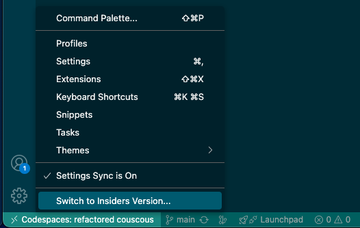

# **GitHub Copilot Agent Mode & Vision Demo**

### **Step 1: Setting Up the Demo**
- **What to show:** A TypeScript API project that you will enhance with Copilot Agent Mode and Vision.
- **Why:** Demonstrate how Copilot can analyze and enhance existing code automatically.
- **How:**  
  - Open the repo in a Codespace.
  - You will have to use **VS Code Insiders** Version to enable the preview features of this demo - check _before_ you demo.
  - To access the Insiders Version in the web-version of a Codespace, click on the gear-icon on the bottom-left and select `Switch to Insiders Version...`

  

### **Step 2: Using Vision to Validate Code Against an ERD**  
- **What to show:** Using an image (ERD) to check the completeness of the generated code.
- **Why:** Demonstrate how Copilot Vision can detect missing entities and relationships from a diagram.
- **How:**  
  1. Open Edits and switch to Agent mode
  1. Attach `ERD.jpg` image using the paperclip icon.
  1. Put in the following prompt:
     ```txt
     First, look at the ERD Diagram and list out all the Entities, Attributes and Relationships you find in there.
     Second, look at the current implementation and validate that all the Entities, their Attributes and Relationships are correctly implemented. 
     ```
  1. Highlight that it detects missing entities (e.g., `supplier`) and relationships (`branch ID` missing in `headquarters`).
  1. Ask Copilot to `add missing routes for all entities` and show it adding a new route.
  1. Make sure the route is exposed in `index.ts`: <br> ```app.use('/api/suppliers', supplierRoutes);```
  1. Accept Copilot’s suggested fixes.

### **Step 3: Enhancing Entities with Name & Description**  
- **What to show:** Automatically adding missing properties (`name` and `description`) to entities.
- **Why:** Demonstrate Copilot’s ability to make multiple changes at one time.
- **How:**  
  1. Ask Copilot to `add name and description properties to all entities`.
  1. Show how it modifies multiple files simultaneously.
  1. Accept the changes.

### **Step 4: Running Terminal Commands & Generating Swagger API Docs**  
- **What to show:** Using Copilot Agent Mode to add Swagger packages and config.
- **Why:** Demonstrate how Copilot can execute commands as part of its flow.
- **How:**  
  1. Ask Copilot to `install Swagger packages and configure API docs for the supplier entity`  
  1. Show how Copilot:  
     - Suggests a command and waits for confirmation.
     - Executes it in the terminal.
     - Updates `index.ts` with Swagger config and generates API docs.
  1. You might need to explicitly ask for the JSON schema defnition of the Supplier entity: `Add the swagger schema definition for the Supplier entity`. 
  1. Run `npm dev`, open `localhost:3000/api/docs`, and show the Swagger UI.
  1. Click on the `/get` route and execute, showing returning of an emtpy array `[]`

### **Step 5: Fixing API Route Issues (only if the above step fails when retrieving the list of entities)**
- **What to show:** Copilot fixing an incorrect API route (`/api/api`).
- **Why:** Demonstrate Copilot’s ability to debug and correct issues in real time.
- **How:**  
  1. Run an API request and show the incorrect `/api/api` route.
  1. Ask Copilot to `fix the Swagger route configuration to remove duplicate /api/api`.
  1. Accept the fix, restart the app, and verify the correct behavior in the Swagger UI.

### **Step 6: Automating Deployment with Docker & GitHub Actions**  
- **What to show:** Copilot generating a Dockerfile and CI/CD workflow.
- **Why:** Show Copilot’s ability to automate deployment setup.
- **How:**  
  1. Ask Copilot to `Create a Dockerfile for an Alpine container add a GitHub Actions workflow for building the container. Use the GitHub package registry to publish the container.`
  2. Show generated files:  
     - `Dockerfile` with correct settings.
     - `.dockerignore` for clean builds.
     - GitHub Actions YAML to build & push the image to GHCR.
  3. Accept the changes.
  4. Commit and push to see the pipeline execution 

### **Step 7: Agent Mode Test Generation**  
- **What to show:** Copilot generating a multiple tests, exucuting them and self-healing.
- **Why:** Show Copilot’s ability to quickly and easily generate tests and validate.
- **How:**  
  1. Ask Copilot to `ensure all entities and routes are tested`
  2. Show generated files tests.
  3. Show Copilot "self-healing" (if tests fail)
  3. Accept the changes.

### **Step 8: Custom instructions**
- **What to show:** Copilot’s **Custom instructions** feature.
- **Why:** Demonstrate that Copilot can be customized and personalized, including internal libraries that do not exist in the foundational models.
- **How:**  
  1. Delete the Supplier route file [src/routes/supplier.ts](src/routes/supplier.ts) if it exists
  1. Create an empty file: `.github/copilot-instructions.md`
  1. Enter the following content:
    ```markdown
    # Guidelines for REST APIs
    
    For REST APIs, use the following guidelines:
    
    * Use descriptive naming
    * Add Swagger docs for all API methods
    * Implement logging and monitoring using [TAO](../docs/tao.md)
      - assume TAO is installed and never add the package
    ```
  1. Mention how there are best practices as well as a doc reference to the TAO framework (a fictional library). Open the [TAO](./tao.md) doc to show the library.
  1. Ask Copilot: `Add the Supplier route`.
  1. Show the changes - note that _this will not compile_ since TAO doesn't really exist!
  
### **Step 9: Next Edit Suggestions for Refactoring Code**  
- **What to show:** Copilot’s **Next Edit Suggestions** feature.
- **Why:** Demonstrate that Copilot can anticipate your next actions.
- **How:**  
  1. Create a `point.ts` file with a `Point` class.
  1. Fill out the code using Code Completion till you have some properties and methods.
  1. Change `class Point` to `class Point3D` and let **Next Edit Suggestions** take over.
  1. Show how **Next Edit Suggestions** proposes changes step by step.
  1. Accept changes incrementally by pressing **Tab** until completion.

## **Key Takeaways for Customers**  
- **Agent Mode handles multi-step changes across multiple files** — saving time.
- **Vision enables Copilot to understand images and auto-generate missing parts.**  
- **Command execution allows Copilot to install dependencies and configure projects.**  
- **Next Edit Suggestions streamlines work.**
